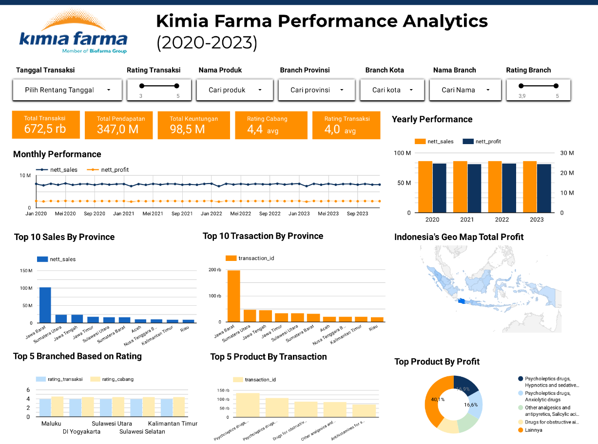

# 📊 Kimia Farma Performance Analytics (2020–2023)

## 📌 Project Overview
This project analyzes **Kimia Farma’s business performance from 2020 to 2023** using sales, profit, transaction, and branch rating data.  
The goal is to generate **insights and recommendations** that can help decision-makers optimize operations, product strategy, and customer experience.  

---

## 🔎 Key Insights
1. **Financial Performance**
   - Total Transactions: **672.5K**  
   - Revenue: **347M**  
   - Profit: **98.5M** → ~28% profit margin.  
   - Sales are stable, but profit growth remains flat → potential efficiency issues.

2. **Yearly & Monthly Trends**
   - Sales remain consistent across years.  
   - Profit has not significantly increased → operational cost optimization needed.  

3. **Regional Contribution**
   - **West Java dominates** sales & transactions.  
   - Other provinces such as **North Sumatra, South Sulawesi, and East Kalimantan** show growth potential.

4. **Product Performance**
   - Top transactions: **Psycholeptics & Anxiolytic drugs**.  
   - Highest profit share: **Psycholeptics & Sedatives (40.1%)** → high-margin products.  

5. **Branch & Customer Ratings**
   - Branch Rating Avg: **4.4 (Good)**  
   - Transaction Rating Avg: **4.0 (Fair)** → improvement in customer experience needed.  

---

## 💡 Business Recommendations
1. **Regional Expansion**  
   Invest in high-potential provinces outside Java with targeted **geo-marketing strategies**.  

2. **Product Focus**  
   Boost promotion of **high-margin products (psycholeptics & sedatives)**, combined with **cross-selling** OTC and supplements.  

3. **Operational Efficiency**  
   Optimize **supply chain & distribution costs** to close the gap between sales and profit.  

4. **Customer Experience**  
   - Improve transaction ratings by ensuring stock availability & faster delivery.  
   - Implement **loyalty programs** and enhance digital touchpoints.  

5. **Diversification**  
   Expand to **OTC drugs, supplements, and herbal products** to reduce dependency on psychotropic drugs.  

---

## 🚀 Action Plan
- **Short-term (3–6 months):** Supply chain audit, promote high-margin products, staff training.  
- **Mid-term (6–12 months):** Regional marketing in Sumatra & Kalimantan, launch loyalty app features.  
- **Long-term (1–2 years):** Product diversification, branch expansion outside Java.  

---

## 📈 Tools & Skills Highlighted
- **Data Visualization:** Looker
- **Data Analysis:** SQL, Looker 
